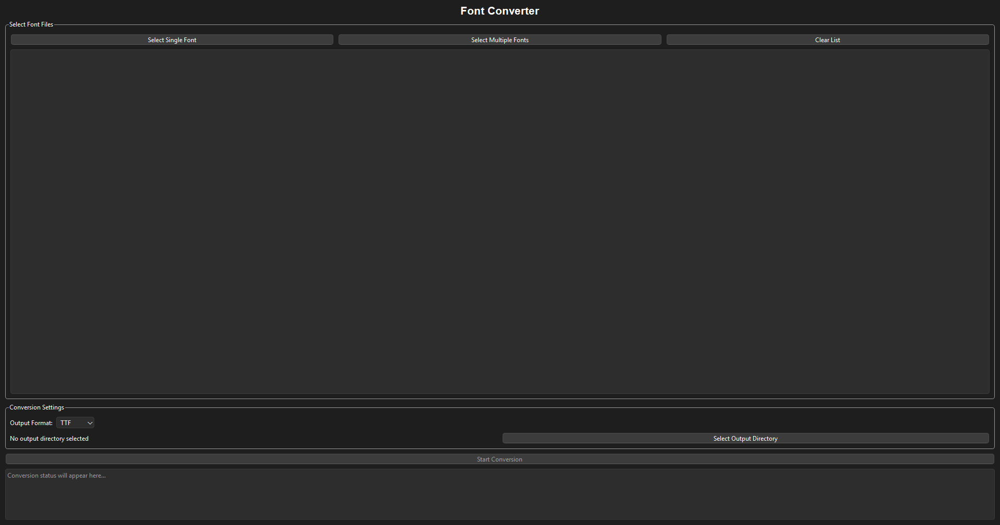
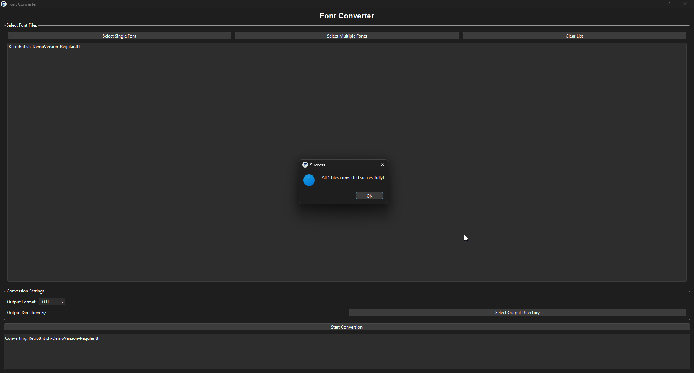

# Font Converter

A simple Python app to convert font files between different formats like TTF, OTF, WOFF, WOFF2, and EOT. Built with PyQt6 for a user-friendly interface.

## About

This app lets you:

- Select one or multiple font files
- Choose an output format (TTF, OTF, WOFF, WOFF2, or EOT)
- Pick a folder to save the converted files
- See the conversion progress and status

**Note:** EOT conversion currently outputs TTF files because EOT is a complex format.

## Project Structure

```
ConvertFont/
│
├─ convert_font.py       # Main Python code
├─ requirements.txt      # Python dependencies
├─ icons/
│   ├─ icon.ico          # App icon for EXE
│   └─ icon.png          # PNG version of the icon
├─ screenshots/          # Folder containing screenshots of the app
│   ├─ main_window.png
│   └─ conversion_result.png
├─ README.md             # This file
└─ .gitignore            # Ignore .venv and other unnecessary files
```

## Installation

This project specifically uses Python 3.12.10. Make sure you have this version installed.

Clone the repository:

```bash
git clone https://github.com/PlayRood32/ConvertFont.git
cd ConvertFont
```

Create and activate a virtual environment (optional but recommended):

```bash
python -m venv .venv
# Windows
.venv\Scripts\activate
# macOS/Linux
source .venv/bin/activate
```

Install the required libraries:

```bash
pip install -r requirements.txt
```

## Usage

Run the app directly with Python:

```bash
python convert_font.py
```

In the app:

1. Click "Select Single Font" or "Select Multiple Fonts" to choose font files.
2. Choose an output format from the dropdown (e.g., TTF, WOFF).
3. Click "Select Output Directory" to pick where to save converted files.
4. Click "Start Conversion" to convert the files.

Check the status area for progress and results.

## Screenshots

### Main Window



### Conversion Result



## Compiling to EXE with PyInstaller

1. Make sure PyInstaller is installed:

```bash
pip install pyinstaller
```

2. Run the following command from the project root:

```bash
pyinstaller --onefile --windowed --icon=./icons/icon.ico convert_font.py
```

- `--onefile` → creates a single EXE file
- `--windowed` → hides the terminal window
- `--icon` → uses your custom icon

The compiled EXE will be located in the `dist/` folder.

## Notes

- The app uses a separate thread to prevent freezing during conversion.
- Make sure your font files are valid.
- For EOT conversion, the app outputs TTF files as a fallback.
- Feel free to contribute or report issues on GitHub!

## License

MIT License
